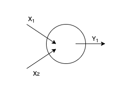
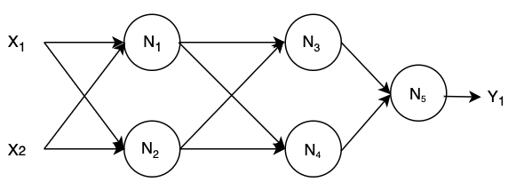

The term Neural Network has been used as a buzzword a lot more than anything else in the world of Computer Science, especially during the last couple decades. What is exactly it?

---

### The building block: Neuron

When it comes to understanding what an _Artificial Neural Network_ is, it is essential to start from its simplest form of building block, the artificial neurons. To get started, let's take a quick look at its sibling, the biological neuron.

##### Biological neuron

The biological neuron is the basic unit of the entire nervous system of animals. A simple animal like [Nematode](https://en.wikipedia.org/wiki/Nematode) has only 302 interconnected neurons which allows them to receive stimuli from the environments and respond to them accordingly. Those 302 neurons build up to 7,000 different neural connections in its nervous system, making it way more complicated that it sounds.

For the case of humans, we are a little bit more complicated with 100,000,000,000 neurons in our body mostly located in the [Central Nervous System (CNS)](https://en.wikipedia.org/wiki/Central_nervous_system) consisting of the brain and spinal cord. Furthermore, human has a bigger diversity in terms of the types of neurons it consists of. In our body, there is a vast array of neurons which can be classified as different from each others, some simple examples are [Unipolar neuron](https://en.wikipedia.org/wiki/Unipolar_neuron), [Bipolar neuron](https://en.wikipedia.org/wiki/Bipolar_neuron), and [Pseudounipolar neuron](https://en.wikipedia.org/wiki/Pseudounipolar_neuron). However, our neurons and those in Nematode are essentially made of the same components and follows the same structure/anatomy as what we'll be describing in the next couple of paragraphs.


<center>The biological neuron anatomy. Source: Wikipedia.</center>

Each component in a biological neuron has its own functions and specialities. Starting from the _cell body_ or _soma_ as the core of a neuron. The _cell body_ carries genetic information and acts as a main sources of energy which drives the entire neuron. It is made of some basic cell components such as _nucleus_ and _mitochondria_ just like any other types of cells.

_Dendrites_ is a tree-like structure branching out from and surrounding the _cell body_. Its main task is basically receiving signals from _axons_ of other neurons through a biological process called [neurotransmission](https://www.sciencedirect.com/topics/medicine-and-dentistry/neurotransmission). The signal will then be processed and sent to the next neurons though a long, tail-like structure named _axon_. Some _axons_ can be really long, and to expedite the transmission process, many _axons_ are wrapped and insulated by a fatty substance called the _myelin sheath_.

Interconnected neurons are basically one of the most important components of our nervous system as a whole. Neurons send/receive signals from/to each others using something called [action potentials](https://en.wikipedia.org/wiki/Action_potential). In brief, it is basically the change of neuron's electric potential triggered by the movement of ions within the neuron itself. This mechanism enables series of neurons to be able to send synapses and makes it possible for us human to perform basic activities such as moving our arms, smelling things, and whatnot.

##### Artificial neuron

After getting a little bit more familiar with what a biological neuron is and how it works, we can now discuss about the artificial neuron. Indeed, they are very similar in some senses. Both the biogical and artificial neurons have a layered architecture where each neuron (or we can mention it as node) are connected to the others, making up a giant network-like structure. Both neurons also share the same capability of taking up some input(s) and producing an output based on that input(s).

The artificial neuron is actually nothing fancy but an entity which **takes one or more inputs**, **apply some mathematical functions on the input data**, and **outputs the computational result of that function execution**.



<center>Example of a 2-inputs neuron.</center>

The common mathematical operations which will be implemented for a regular neuron are just as simple as multiplication and addition. Let's use our 2-inputs neuron as an example to make the explanations clearer. There are 3 majors steps that have to be done before coming up with the output.

First thing is basically to multiply each of the inputs with their corresponding weights like the following expression:

$$
x_{1} * w_{1}
$$

$$
x_{2} * w_{2}
$$

**NOTE** - Please be noted that $x_{1}$ and $x_{2}$ need not always be a scalar value. They can be vectors but the data structure of both $w_{1}$ and $w_{2}$ have to be adjusted accordingly as well.

After obtaining the products of each input and the weight associated with it, we will find the sum of these products and add them with a bias $b$.

$$
(x_{1} * w_{1}) + (x_{2} * w_{2}) + b
$$

Lastly, we'll take the value that we got from the previous step and feed it into a particular kind of [activation function](https://en.wikipedia.org/wiki/Activation_function) to get the output $y_{1}$.

$$
y_{1} = f((x_{1} * w_{1}) + (x_{2} * w_{2}) + b)
$$

Those whole series of processes is what we call as **feedforward**. I usually think of it as a chain of mathematical operations involving multiple inputs to finally arrive at an output.

##### Coding an Artificial Neuron from scratch

Let's jump into some codes to get a better hang of what I have just explained. We'll be using python for the demo, and the code would follow _object-oriented_ paradigm.

But before that, recall that we need something called an _activation function_ to be able to build an artificial neuron. To avoid confusion, we'll be implementing one using one of the most common _activation function_, namely the [sigmoid function](https://deepai.org/machine-learning-glossary-and-terms/sigmoid-function). It can be represented by the following formula:

$$
f(x) = \frac{1}{1 + \exp^{-x}}
$$

The semantic of the _sigmoid function_ is basically to bound any value $x, x ∈ (-\infin, \infin)$, to $x', x' ∈ (0, 1)$.

Now after getting some ideas about what a _sigmoid function_ does, we can jump into our code.

```python
import numpy as np

class Neuron:
  def __init__(self, weights, biases):
    self.weights = np.array(weights)
    self.biases = np.array(biases)

  def sigmoid(self, input):
    return 1 / (1 + np.exp(-input))

  def feedForward(self, inputs):
    weights, biases = self.weights, self.biases
    inputs = np.array(inputs)

    return self.sigmoid(np.dot(inputs, weights) + biases)

neuron = Neuron([0.3, 0.7], 0.5)
print(neuron.feedForward([16, 2])) #prints 0.9987706013787226
```

### Neural network

##### Introduction

Recall our previous discussion about the biological neuron where we touched a little bit about our _Central Nervous System_. An artificial neural network is to artificial neurons as our central nervous system is to biological neurons. To put it simpler, it is basically just a bunch of interconnected artificial neurons spread across multiple layers where each neuron carries different set of weights and bias.



<center>Example of a 5-neurons Artificial Neural Network.</center>

Please be aware that for some of neurons in the middle (N<sub>3</sub>, N<sub>4</sub>, and N<sub>5</sub>), their inputs come from the computational result of the previous neurons. This is what we refer to as _hidden layers_, since they don't interact directly with the external input or output data anyway.

In brief, the feedforward flow of our neural network example can be represented by the following mathematical expressions (assume we use sigmoid as the activation function for all neurons).

$$
f(x) = \frac{1}{1 + \exp^{-x}}
$$

$$
N_{1} = f((x_{1} * w_{1.1}) + (x_{2} * w_{1.2}) + b_{1})
$$

$$
N_{2} = f((x_{1} * w_{2.1}) + (x_{2} * w_{2.2}) + b_{2})
$$

$$
N_{3} = f((N_{1} * w_{3.1}) + (N_{2} * w_{3.2}) + b_{3})
$$

$$
N_{4} = f((N_{1} * w_{4.1}) + (N_{2} * w_{4.2}) + b_{4})
$$

$$
Y_{1} = N_{5} = f((N_{3} * w_{5.1}) + (N_{4} * w_{5.2}) + b_{5})
$$

##### Coding a neural network from scratch

Building upon our previous code example, let's build a simple neural network which consists of 5 neurons.

```python
import numpy as np

class Neuron():
  # Please see the code example above to see the detailed class definition of Neuron
  pass

class NeuralNetwork():
  def __init__(self):
    # We'll create a set of homogeneous neurons for simplicity
    # Feel free to play around with the code and change stuffs
    self.n1 = Neuron([0.3, 0.7], 0.5)
    self.n2 = Neuron([0.3, 0.7], 0.5)
    self.n3 = Neuron([0.3, 0.7], 0.5)
    self.n4 = Neuron([0.3, 0.7], 0.5)
    self.n5 = Neuron([0.3, 0.7], 0.5)

  def feedForward(self, inputs):
    n1_result = self.n1.feedForward(inputs)
    n2_result = self.n2.feedForward(inputs)

    n3_result = self.n3.feedForward(np.array([n1_result, n2_result]))
    n4_result = self.n4.feedForward(np.array([n1_result, n2_result]))

    n5_result = self.n5.feedForward(np.array([n3_result, n4_result]))

    return n5_result

neuralNetwork = NeuralNetwork()
print(neuralNetwork.feedForward([16, 2])) # prints 0.7887473167735787
```

### Conclusion

In conclusion, we have taken a look at the definition of neurons from both biological and machine learning perspectives. We have also learnt about how each one of them works.

We are all now must be familiar with what an artificial neural network is. It is nothing but a bunch of interconnected artificial neurons. Given a set of inputs, the goal is to find an output based on some mathematical expressions embedded in each of the neuron.

In the upcoming post, we will see how to train such a network using some more advanced concepts like [Loss function](https://en.wikipedia.org/wiki/Loss_function) and [Gradient descent](https://en.wikipedia.org/wiki/Gradient_descent#:~:text=Gradient%20descent%20is%20a%20first,function%20at%20the%20current%20point.).

That's it, I hope you enjoy reading my post and thanks for coming by!
