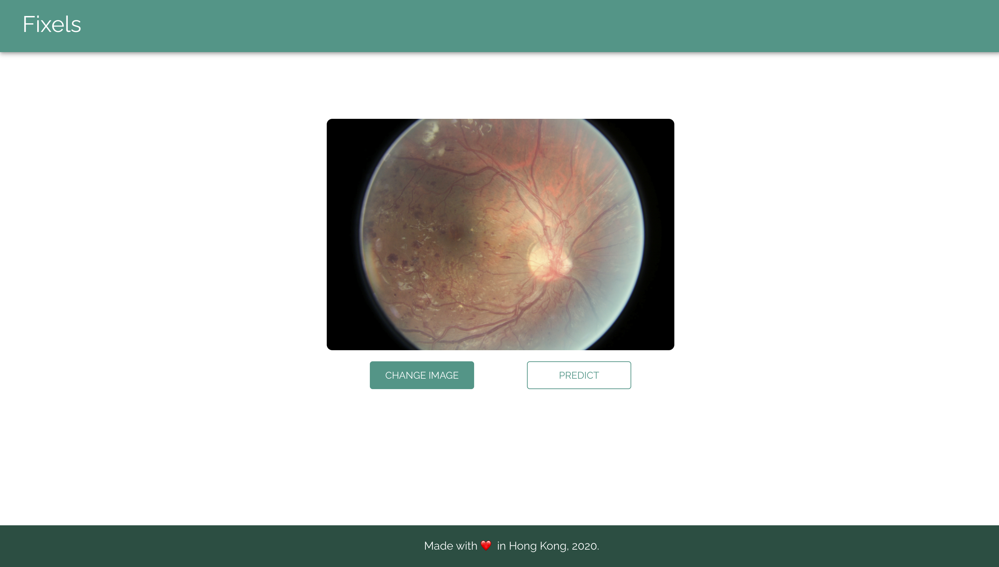
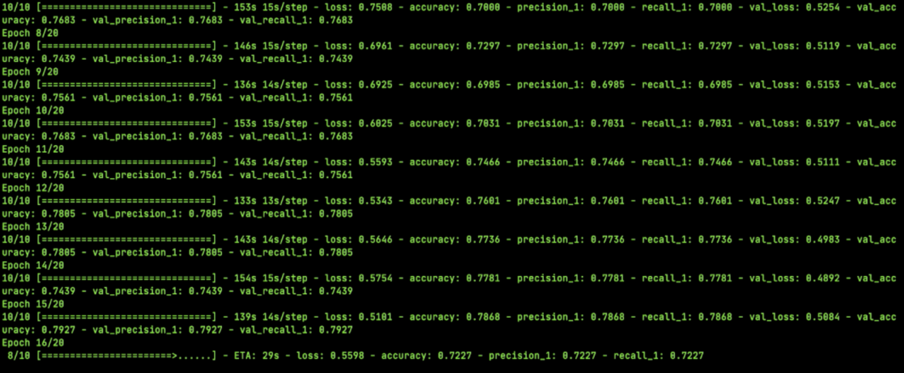

### Description

[Fixels](https://github.com/welvin21/fixels) is a platform to help opthalmologists in generating quick, accurate, and reliable [diabetic retinopathy](https://www.nei.nih.gov/learn-about-eye-health/eye-conditions-and-diseases/diabetic-retinopathy) diagnosis via retinal images. In [Fixels](https://github.com/welvin21/fixels), we use a convolutional neural network model trained on thousands of labeled retinal images from [kaggle public datasets](https://www.kaggle.com/c/diabetic-retinopathy-detection) and [messidor private datasets](http://www.adcis.net/en/third-party/messidor/).

The model was trained on [HKU GPU server](https://www.cs.hku.hk/gpu-farm/home), and yields an accuracy near to **80%** on validation data. Finally, We connected the core functionality of [Fixels](https://github.com/welvin21/fixels) to a web application as an interface which can be easily accessed and used by everyone.

Figure 1: Fixels web interface

Figure 2: Fixels model training log

### Relevant Links

- [GitHub repository](https://github.com/welvin21/fixels)
- [Project paper](https://docs.google.com/document/d/1LZa8fqrnkVMQ4Fa4gENu2jrBmWHiHxfJiUicABZoceI/edit)
- [Project presentation](https://docs.google.com/presentation/d/1CYVJtrq3uHt2-6hDp-QX7ag71pEPAqrRGTvqHc5mds8/edit#slide=id.g7fc3b92232_1_49)

### Tech and tools

- Frontend using [React](https://reactjs.org/), written on [TypeScript](https://www.typescriptlang.org/)
- Model was built and trained on top of [Keras](https://keras.io/) APIs, written on [Python](https://www.python.org/), following [object-oriented](https://en.wikipedia.org/wiki/Object-oriented_programming) practice
- [Flask](https://flask.palletsprojects.com/en/1.1.x/) as a RESTful API that connects both ends of the application

### Other contributors (in alphabetical order)

- [Edward Suryajaya](https://github.com/edward210400)
- [Fernando Julio Cendra](https://github.com/fcendra)
