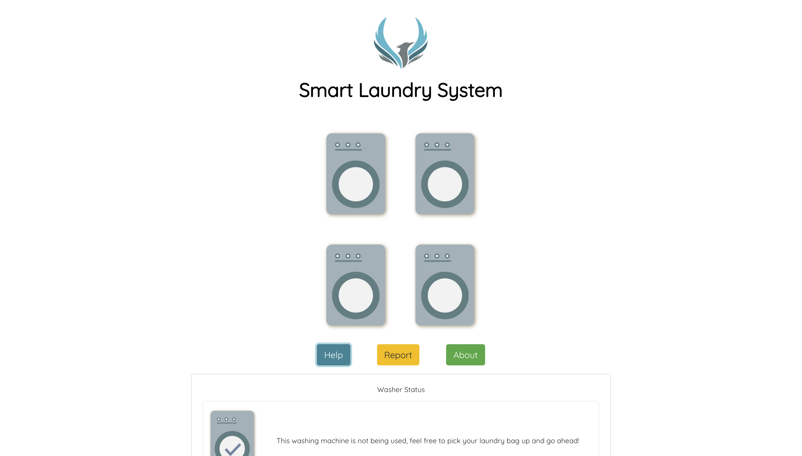

### Description

[SLS](https://sls.rctech.club) is an IoT project by [RC Tech Club](https://www.rctech.club/) which gives information regarding washing machines status for R.C. Lee hall residents. Since all washing machines in the building are located on the 16th floor, often times during peak hours, people had to go back and forth to check if any of the machines is not occupied by someone else. Using [SLS](https://sls.rctech.club), residents need not to worry anymore since the status of all washing machines can be tracked via the internet.

Figure 1: SLS website

Figure 2: SLS promotion poster

### Relevant Links

- [Website](https://sls.rctech.club)
- [Github repository](https://github.com/rcltech/sls)

### Tech and tools

- Frontend using [React](https://reactjs.org/), written on JavaScript
- [AWS Lambda](https://aws.amazon.com/lambda/) as a serverless hook to send requests to [Phoenix](https://github.com/rcltech/phoenix) (RC Tech Data API server)

### Other contributors (in alphabetical order)

- Angela Park
- [Sean Chok](https://github.com/98sean98)
- [Siddhant Bagri](https://github.com/sidb28)
- [Utkarsh Goel](https://github.com/utkarsh867)
- [Waqas Ali](https://github.com/waqasAliAbbasi/)
