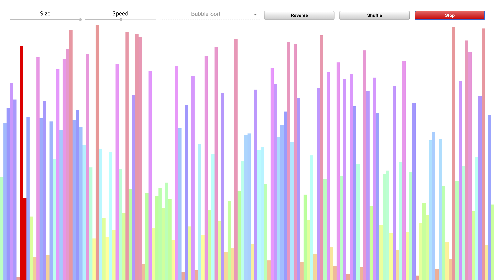

### Description

[SortIt](https://sort.welvin21.com) is a sorting algorithms visualizer that is running on the web. There 10 different sorting algorithms available on [SortIt](https://sort.welvin21.com). Some of them are Bubble Sort, Insertion Sort, Merge Sort, Quick Sort, and Heap Sort.

[SortIt](https://sort.welvin21.com) started off as a personal project with the motivation to help everyone understand different sorting techniques better. When I first learnt about sorting algorithms, I often found it hard to get the hang of them by just looking at the code implementations. By providing a visualizer where people can see and track the movement of each element in the array, I hope it learning process can be easier and more enjoyable for everybody.

Figure 1: SortIt website

### Relevant Links

- [Website](https://sort.welvin21.com)
- [Github repository](https://github.com/welvin21/sortit)

### Tech and tools

- Frontend using [React](https://reactjs.org/), written on JavaScript
- Global state management using [Redux](https://redux.js.org/)
- Continuous deployment on github pages using [Travis-CI](https://travis-ci.org/)
- [Google Analytics](https://analytics.google.com/) as website traffic tracker
