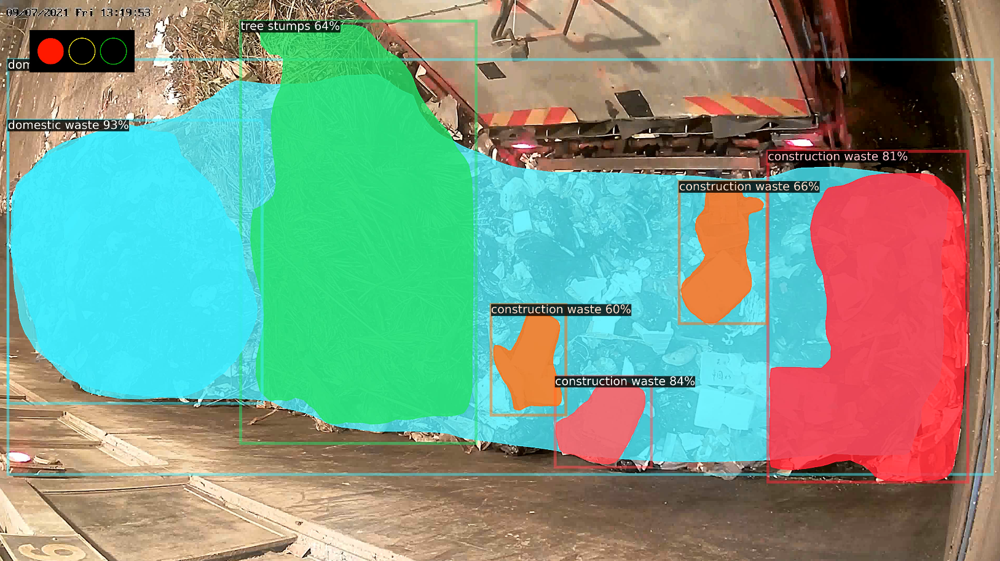

##### Description

Trashtank is a computer vision project that I worked on as a side hustle with [Clearbot](https://www.clearbot.org/). It aims to solve waste management problem where trash can be classified into different categories, easing the process of waste separation and filtration before they can be put into a staging area.

Trashtank detects trash objects from a continuous stream of cctv video camera and classifies them into multiple categories, some of which are domestic and construction waste. It then uses a customized warning algorithm to calculate a warning score which will then be used to generate warnings depending on the amount of unacceptable waste (for example construction waste) in the frame. This removes the need for manual human supervision.

Figure 1: Trashtank in action

